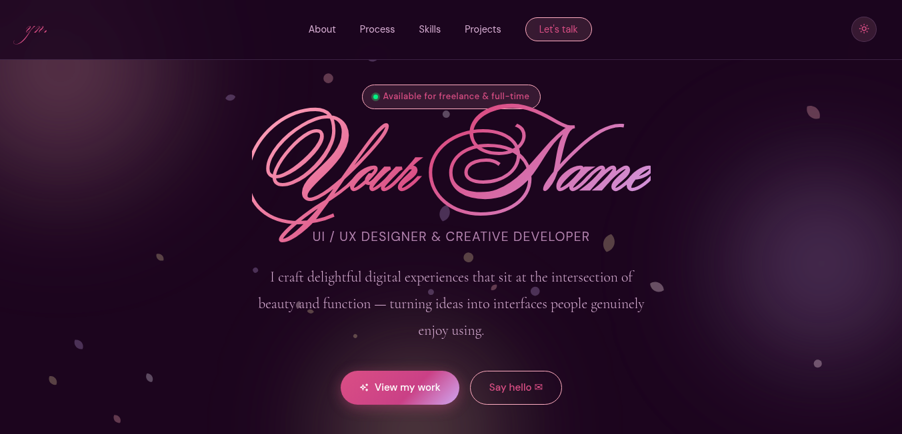

# Portfolio Template

A modern, minimal portfolio template for developers and creatives — built to look great out of the box and easy to personalize.

**Live demo → [portfolio-template-nine-black.vercel.app](https://portfolio-template-nine-black.vercel.app/)**



## Features

- Dark / light mode toggle
- Scroll-based marquee animation
- Project cards with tags
- Testimonials section
- Contact form layout
- Fully responsive

## Get started

```bash
git clone https://github.com/sugumaran-nix/portfolio-template.git
cd portfolio-template
# open index.html in your editor and replace placeholder content
```

## Customize

| What | Where |
|------|-------|
| Name, title, bio | `index.html` — hero section |
| Projects | `index.html` — work section |
| Skills | `index.html` — skills section |
| Colors / fonts | `assets/css/style.css` |
| Profile photo | `assets/images/` |
| Resume PDF | `assets/resume.pdf` |

## Deploy

Works on [Vercel](https://vercel.com), [Netlify](https://netlify.com), or GitHub Pages — drop in the repo and deploy.

## License

MIT — free to use, fork, and modify. A ⭐ is appreciated if this helped you.
